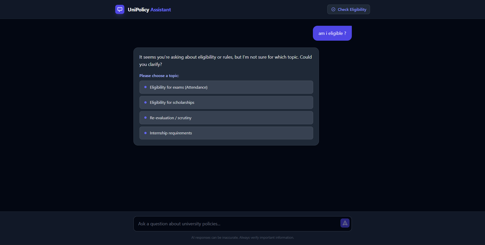

# UniPolicy Assistant (Challenge 2)

An intelligent, context-aware university policy assistant featuring ScaleDown compression, deterministic rule logic, and an interactive disambiguation engine.


## 🚀 Features

- **Topic Disambiguation Engine**: Detects vague queries (e.g., "Am I eligible?") and uses a smart clarification UI to lock in the correct policy topic.
- **ScaleDown Integration**: Reduces LLM context window costs by compressing prompts before generation, with full metrics tracking.
- **Eligibility Simulator**: A deterministic logic layer (no hallucination) to verify student eligibility for exams, scholarships, and graduation.
- **RAG Pipeline**: Retrieves relevant policy clauses using keyword and semantic matching.
- **Clean Architecture**: Modular FastAPI backend + Vite React frontend.

## 🛠 Tech Stack

- **Backend**: Python 3.10+, FastAPI, Uvicorn
- **Frontend**: React, Vite, Tailwind CSS
- **Compression**: ScaleDown API
- **Testing**: Pytest

## 📦 Setup & Installation

### 1. Backend Setup (Python)

It is recommended to create the virtual environment **outside** the repo or use the ignored local `venv` folder.

```bash
cd backend

# Create virtual environment
python -m venv venv

# Activate (Windows)
venv\Scripts\activate
# Activate (Mac/Linux)
source venv/bin/activate

# Install dependencies
pip install -r requirements.txt

# Configure Environment
cp .env.example .env
# Edit .env with your SCALEDOWN_API_KEY if available
```

Run the backend:
```bash
python run.py
# Server starts at http://localhost:8080
```

### 2. Frontend Setup (React)

```bash
cd client
npm install
npm run dev
# 🎓 UniPolicy Assistant  
### Intelligent • Deterministic • Cost-Optimized University Policy AI  
**ScaleDown AI Challenge – Challenge 2 Submission**
```
---

## 📌 Project Overview

UniPolicy Assistant is a production-grade, context-aware university policy assistant designed to deliver **accurate, explainable, and cost-efficient responses** to student queries.

Unlike traditional chatbot systems that rely purely on probabilistic LLM outputs, this system combines:

- 🔍 Retrieval-Augmented Generation (RAG)
- 🧠 Interactive Clarification Engine
- ⚙️ Deterministic Eligibility Simulation
- 📉 ScaleDown Context Compression
- 📊 Real-Time Metrics & Observability

The result is a hybrid AI system that prevents hallucination in numeric decisions, eliminates ambiguity errors, reduces token usage costs, and provides transparent policy-based answers with confidence scoring.

---

# 🖥️ User Interface Walkthrough

---

## 🏠 Home Interface


The main interface is designed with a clean, modern dark UI optimized for clarity and structured responses.

### Key UI Elements:
- Minimal distraction layout
- Structured answer cards
- Confidence score indicator
- Expandable policy source references
- Fixed bottom input bar for seamless querying

The design ensures students can interact naturally while maintaining clarity and trust in system responses.

---

## 🤖 Smart Disambiguation (Interactive Clarification Engine)



When a user submits an ambiguous query such as:

> “Am I eligible?”

The system does **NOT** guess.

Instead:

1. The Ambiguity Checker scans the query using regex + keyword logic.
2. If ambiguity is detected, the backend returns:
	 ```json
	 {
		 "needs_clarification": true,
		 "options": ["Attendance", "Scholarship", "Internship"]
	 }
	 ```

The frontend displays selectable options.

The user selects the intended topic.

Retrieval continues with the locked topic.

Why This Matters

Traditional chatbots:

Assume intent

Frequently answer incorrectly

Our system:

Forces topic confirmation

Prevents retrieval errors

Increases accuracy and trust

This is Unique Feature #1 of the project.

📋 Eligibility Simulation Modal

The eligibility modal allows users to input:

Attendance (%)

CGPA

Internship Completion Status

Instead of relying on LLM reasoning for numeric thresholds, this module uses deterministic logic.

✅ Deterministic Eligibility Results

Results are generated using rule-based logic.

Implemented Rules
Exam Eligibility: attendance >= 75.0
Merit Scholarship: cgpa >= 8.5
Graduation Clearance: internship == True
Why Deterministic Logic?

LLMs are probabilistic.
Numeric boundary decisions must be exact.

This module:

Prevents hallucinations

Handles edge cases precisely (74.99 vs 75.0)

Returns structured JSON

Provides clear explanations

This is Unique Feature #2 of the project.

📊 Metrics & Observability

The /metrics/summary endpoint provides:

Total Requests

Average Latency

Ambiguity Detection Rate

Error Rate

Token Savings via ScaleDown Compression

This transforms the project from a simple chatbot into a monitored, observable AI system.

🏗️ System Architecture

🔄 High-Level Query Processing Flow
Step 1 – User Query

Frontend (React) sends:

POST /ask
Step 2 – Ambiguity Checker

Scans query for vague keywords

If ambiguous:

Returns clarification options

Stops retrieval pipeline

Step 3 – Retriever (RAG Layer)

Fetches relevant policy clauses from structured JSON

Uses keyword + semantic matching

Step 4 – ScaleDown Compression

Compresses retrieved context

Reduces token usage

Logs metrics for token savings

Step 5 – LLM Answer Generation

Receives compressed context

Generates structured response

Includes policy source references

Step 6 – Structured Response

Returns:

Final answer

Confidence score

Policy source IDs

🔁 Eligibility Simulation Flow

User opens modal

Inputs:

Attendance

CGPA

Internship Status

Frontend sends:

POST /simulate/eligibility

Backend applies deterministic rules

Returns structured response:

{
	"exam": "yes",
	"scholarship": "no",
	"graduation": "warning"
}

This flow operates completely independently from the LLM.

🚀 Core Features
🧠 1. Interactive Clarification Engine

Detects ambiguous queries

Prevents incorrect topic retrieval

Locks policy domain before answering

Improves system accuracy

⚙️ 2. Deterministic Rule Engine

Enforces numeric thresholds precisely

No probabilistic boundary errors

Transparent logic

Structured responses

📉 3. ScaleDown Context Compression

Before sending context to the LLM:

Retrieved clauses are compressed.

Token count is reduced.

Metrics service logs savings.

Benefits:

Lower operational cost

Faster inference

Maintained semantic quality

🔍 4. Retrieval-Augmented Generation (RAG)

Policy clauses stored in structured JSON

Controlled retrieval mechanism

Source references returned

Confidence scoring included

📊 5. Observability & Monitoring

The system tracks:

Total requests

Average latency

Ambiguity rate

Error rate

Token savings

This makes the system production-ready.

🛠️ Tech Stack
Backend

Python 3.10+

FastAPI

Uvicorn

Pytest

Frontend

React

Vite

Tailwind CSS

AI Layer

ScaleDown API

Retrieval-Augmented Generation

Deterministic Rule Engine

📦 Setup Instructions
Backend Setup
cd backend
python -m venv venv
venv\Scripts\activate   # Windows
source venv/bin/activate  # Mac/Linux
pip install -r requirements.txt
cp .env.example .env

Run:
python run.py

Server runs at:

http://localhost:8080
Frontend Setup
cd client
npm install
npm run dev

App runs at:

http://localhost:5173
🔐 Environment Variables
Variable	Description
SCALEDOWN_API_KEY	API key for compression
BACKEND_PORT	FastAPI server port
MODEL_NAME	LLM model ID
CORS_ORIGINS	Allowed frontend origins
🧪 Testing

Run full backend test suite:

cd backend
python -m pytest

Verification script:

python verify_phase1.py
📡 API Endpoints
Endpoint	Method	Purpose
/ask	POST	Main chat endpoint (handles ambiguity & compression)
/simulate/eligibility	POST	Deterministic eligibility checking
/metrics/summary	GET	Observability metrics
🎯 What Makes This Project Different?

✅ Hybrid AI + Deterministic Logic
✅ Ambiguity-First Design
✅ Token Optimization via ScaleDown
✅ Structured Source Transparency
✅ Observability Built-In
✅ Modular, Production-Ready Architecture

🏆 Challenge Perspective

This project demonstrates:

How to reduce LLM token cost

How to prevent hallucination in policy systems

How to combine AI reasoning with deterministic rule engines

How to build trustworthy, explainable AI systems

This is not just a chatbot —
it is a structured AI decision platform designed for reliability and scalability.

Built for the ScaleDown AI Challenge.

## 👤 Author

Dhruv Chandrakant Ghanchi  
GitHub: https://github.com/Dhruv-Ghanchi  
LinkedIn: https://www.linkedin.com/in/dhruv-ghanchi-9b0180371/
