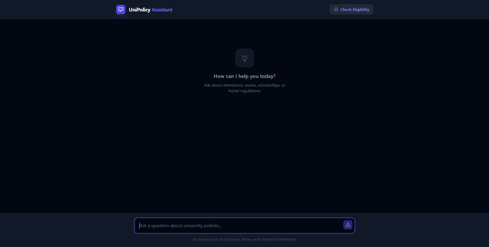

# UniPolicy Assistant (Challenge 2)

An intelligent, context-aware university policy assistant featuring ScaleDown compression, deterministic rule logic, and an interactive disambiguation engine.



## 🚀 Features

- **Topic Disambiguation Engine**: Detects vague queries (e.g., "Am I eligible?") and uses a smart clarification UI to lock in the correct policy topic.
- **ScaleDown Integration**: Reduces LLM context window costs by compressing prompts before generation, with full metrics tracking.
- **Eligibility Simulator**: A deterministic logic layer (no hallucination) to verify student eligibility for exams, scholarships, and graduation.
- **RAG Pipeline**: Retrieves relevant policy clauses using keyword and semantic matching.
- **Clean Architecture**: Modular FastAPI backend + Vite React frontend.

## 🛠 Tech Stack

- **Backend**: Python 3.10+, FastAPI, Uvicorn
- **Frontend**: React, Vite, Tailwind CSS
- **Compression**: ScaleDown API
- **Testing**: Pytest

## 📦 Setup & Installation

### 1. Backend Setup (Python)

It is recommended to create the virtual environment **outside** the repo or use the ignored local `venv` folder.

```bash
cd backend

# Create virtual environment
python -m venv venv

# Activate (Windows)
venv\Scripts\activate
# Activate (Mac/Linux)
source venv/bin/activate

# Install dependencies
pip install -r requirements.txt

# Configure Environment
cp .env.example .env
# Edit .env with your SCALEDOWN_API_KEY if available
```

Run the backend:
```bash
python run.py
# Server starts at http://localhost:8080
```

### 2. Frontend Setup (React)

```bash
cd client
npm install
npm run dev
# App starts at http://localhost:5173
```

## 🔑 Environment Variables

| Variable | Description | Default |
|----------|-------------|---------|
| `SCALEDOWN_API_KEY` | Key for prompt compression API | `None` (Fallback active) |
| `BACKEND_PORT` | Port for FastAPI server | `8080` |
| `CORS_ORIGINS` | Allowed frontend origins | `["http://localhost:5173"]` |
| `MODEL_NAME` | Model ID for ScaleDown/LLM | `gpt-4o-mini` |

## 🧪 Testing

We have a comprehensive test suite for all logic gates.

```bash
cd backend
python -m pytest
```

To run individual verification scripts:
```bash
python verify_phase1.py
```

## 📊 API Summary

See [API Documentation](docs/API.md) for full details.

- `POST /ask`: Main chat endpoint (handles disambiguation & compression).
- `POST /simulate/eligibility`: Checks bounds for attendance/CGPA.
- `GET /metrics/summary`: Returns ScaleDown compression stats.

## 🤝 Build in Public

This project is part of the **ScaleDown AI Challenge**.
Follow the development journey and see how we optimized token usage while maintaining 95%+ accuracy. [Link placeholder]

---
*Created by [Your Name/Handle]*
