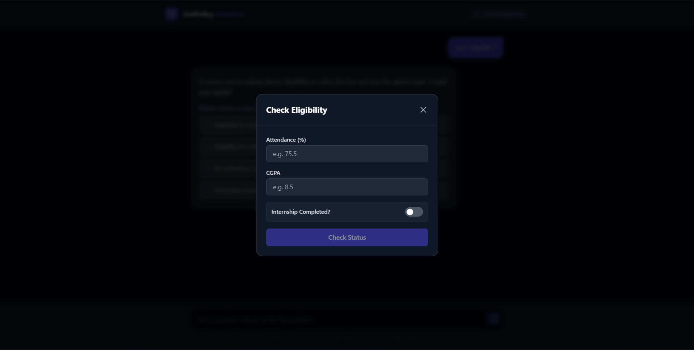
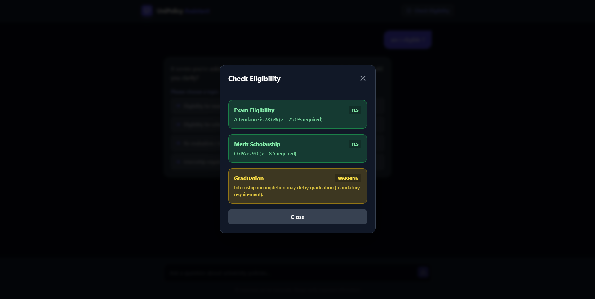
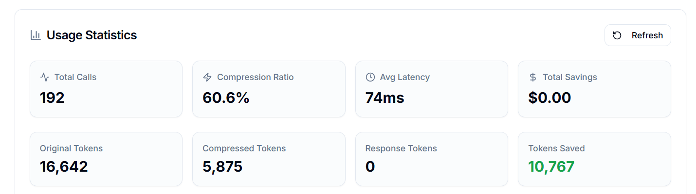

# 🎓 UniPolicy Assistant (Challenge 2)

An intelligent, context-aware university policy assistant featuring **ScaleDown compression**, **deterministic rule logic**, and an **interactive disambiguation engine**.


---

## 🚀 Features

- **Topic Disambiguation Engine**: Detects vague queries (e.g., "Am I eligible?") and uses a smart clarification UI to lock in the correct policy topic.
- **ScaleDown Integration**: Reduces LLM context window costs by compressing prompts before generation, with full metrics tracking.
- **Eligibility Simulator**: A deterministic logic layer (no hallucination) to verify student eligibility for exams, scholarships, and graduation.
- **RAG Pipeline**: Retrieves relevant policy clauses using keyword and semantic matching.
- **Clean Architecture**: Modular FastAPI backend + Vite React frontend.

---

## 📌 Project Overview

UniPolicy Assistant is a production-grade, context-aware university policy assistant designed to deliver **accurate, explainable, and cost-efficient responses** to student queries.

Unlike traditional chatbot systems that rely purely on probabilistic LLM outputs, this system combines:

- 🔍 **Retrieval-Augmented Generation (RAG)**
- 🧠 **Interactive Clarification Engine**
- ⚙️ **Deterministic Eligibility Simulation**
- 📉 **ScaleDown Context Compression**
- 📊 **Real-Time Metrics & Observability**

---

# 🖥️ User Interface Walkthrough

---

## 🏠 Home Interface


The main interface is designed with a clean, modern dark UI optimized for clarity and structured responses.

---

## 🤖 Smart Disambiguation


1. The Ambiguity Checker scans the query using regex + keyword logic.
2. If ambiguity is detected, the backend returns:

```json
{
  "needs_clarification": true,
  "options": ["Attendance", "Scholarship", "Internship"]
}
```

3. The frontend displays selectable options.
4. The user selects the intended topic.
5. Retrieval continues with the locked topic.

---

## 📋 Eligibility Simulation Modal



Users input:
- Attendance (%)
- CGPA
- Internship Completion Status

---

## ✅ Deterministic Eligibility Results



### Implemented Rules

```python
Exam Eligibility: attendance >= 75.0
Merit Scholarship: cgpa >= 8.5
Graduation Clearance: internship == True
```

---

## 📊 Metrics & Observability



The `/metrics/summary` endpoint provides:

- Total Requests
- Average Latency
- Ambiguity Detection Rate
- Error Rate
- Token Savings

---

# 🏗️ System Architecture


---

## 🔄 High-Level Query Flow

1. Frontend sends:

```
POST /ask
```

2. Ambiguity Checker scans query.
3. Retriever fetches policy clauses.
4. ScaleDown compresses context.
5. LLM generates structured response.
6. Response includes answer, confidence score, and source references.

---

## 🔁 Eligibility Simulation Flow

1. User opens modal.
2. Inputs attendance, CGPA, internship status.
3. Frontend sends:

```
POST /simulate/eligibility
```

4. Backend applies deterministic rules.
5. Returns:

```json
{
  "exam": "yes",
  "scholarship": "no",
  "graduation": "warning"
}
```

---

## 🛠 Tech Stack

### Backend
- Python 3.10+
- FastAPI
- Uvicorn
- Pytest

### Frontend
- React
- Vite
- Tailwind CSS

### AI Layer
- ScaleDown API
- Retrieval-Augmented Generation
- Deterministic Rule Engine

---

## 📦 Setup & Installation

### Backend Setup

```bash
cd backend
python -m venv venv
venv\Scripts\activate   # Windows
source venv/bin/activate  # Mac/Linux
pip install -r requirements.txt
cp .env.example .env
python run.py
```

Server runs at:

```
http://localhost:8080
```

---

### Frontend Setup

```bash
cd client
npm install
npm run dev
```

App runs at:

```
http://localhost:5173
```

---

## 🧪 Testing

```bash
cd backend
python -m pytest
```

---

## 📡 API Endpoints

| Endpoint | Method | Purpose |
|----------|--------|---------|
| `/ask` | POST | Main chat endpoint |
| `/simulate/eligibility` | POST | Deterministic eligibility checking |
| `/metrics/summary` | GET | Observability metrics |

---

## 👤 Author

Dhruv Chandrakant Ghanchi  
GitHub: https://github.com/Dhruv-Ghanchi  
LinkedIn: https://www.linkedin.com/in/dhruv-ghanchi-9b0180371/
