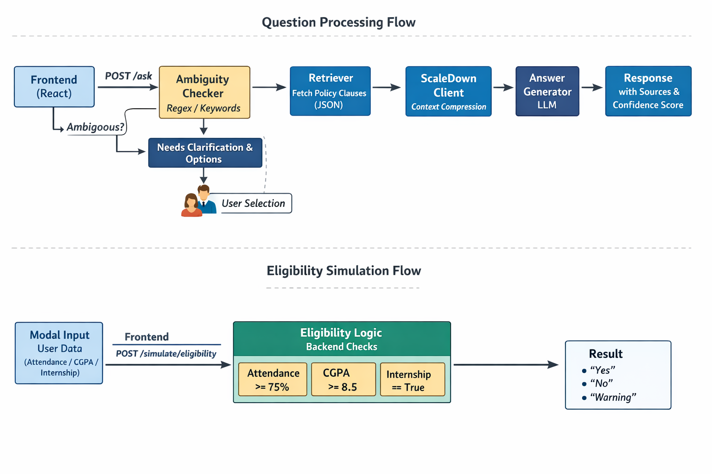

# System Architecture

## High-Level Flow



1.  **Frontend (React)** sends user query to `POST /ask`.
2.  **Ambiguity Checker** (Regex/Keyword) scans query.
    *   If ambiguous -> Returns `needs_clarification: true` + Options.
    *   Frontend displays buttons -> User clicks -> New request with `topic`.
3.  **Retriever** fetches relevant policy clauses (JSON).
4.  **ScaleDown Client** compresses the retrieved context.
    *   *Metrics Service* logs tokens saved.
5.  **Answer Generator** (LLM) creates the final response using the *compressed* context.
6.  **Response** sent back with sources and confidence score.

## Eligibility Simulation Flow

1.  **Modal Input**: User enters Attendance, CGPA, Internship status.
2.  **Frontend** posts to `/simulate/eligibility`.
3.  **Backend Logic** (Deterministic):
    *   Exam Logic: `attendance >= 75.0`
    *   Scholarship Logic: `cgpa >= 8.5`
    *   Graduation Logic: `internship == true`
4.  **Result**: JSON response with status ("yes"/"no"/"warning") and explanation.

## Directory Structure

```
backend/
├── app/
│   ├── services/
│   │   ├── scaledown_client.py  # Compression integration
│   │   └── metrics.py           # Stats tracking
│   ├── ambiguity_checker.py     # Disambiguation logic
│   ├── answer_generator.py      # LLM / Template Wrapper
│   └── main.py                  # FastAPI Routes
├── data/                        # JSON Policy Data
└── tests/                       # Pytest Suite
```
